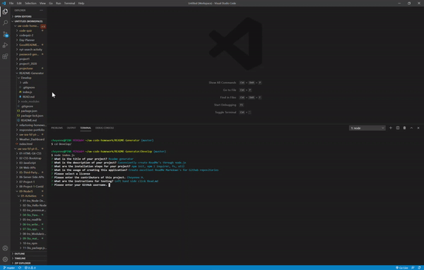
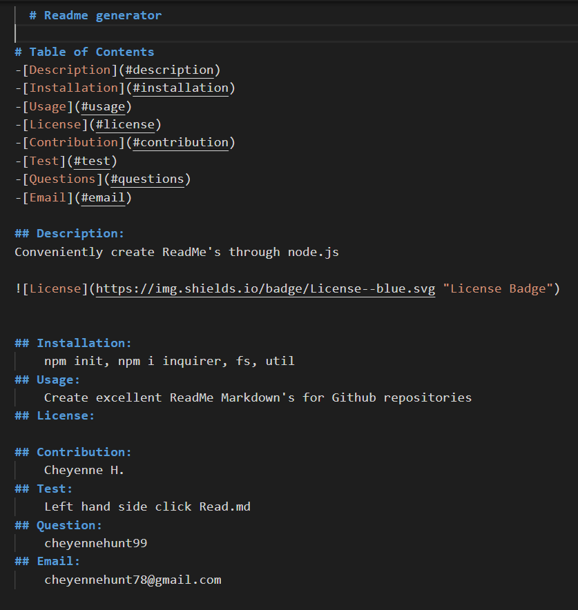

# README-Generator

## Demo

## Table of contents

- [General info](#general-info)
- [Technologies](#Technologies)
- [Summary](#Summary)
- [Usage](#Usage)
- [Expectations](#Expectations)
- [Author](#Author)
- [License](#License)

## General info

CLI app that helps generates README.md files. `index.js` will ask you a series of questions by reading your `package.json` to generate you a README!

## Technologies

package.json
JavaScript
Node.js

## Summary

ReadMe generator for GitHub repositories created using node.js

## Usage

Make sure you create a .gitignore including files node_modules/ and .DS_store/
Next you want to install npm init, npm inquirer, npm fs, & npm util

## Expectations

## Author

Cheyenne Hunt

## License

Open Source